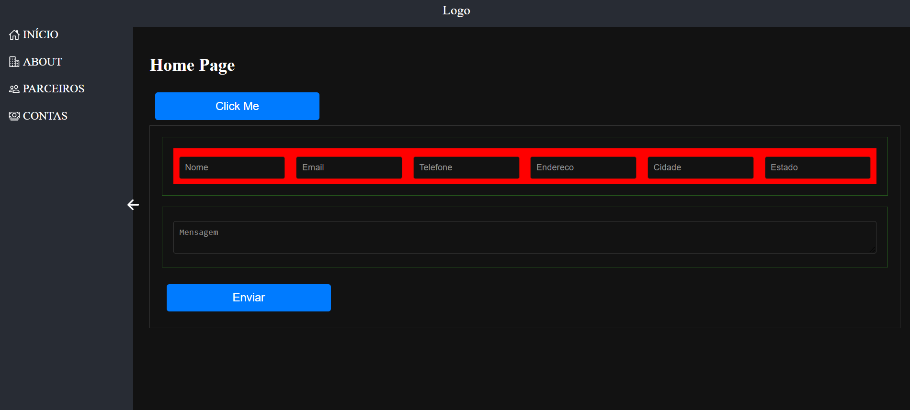
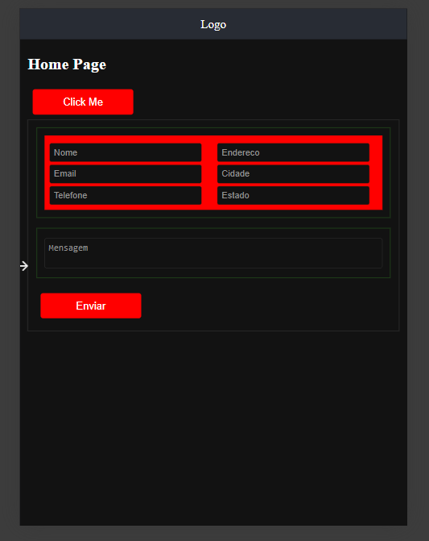

# React + TypeScript + StyledComponent

## Descrição

A criação de interfaces de usuário eficientes e escaláveis é um desafio constante no desenvolvimento web moderno. Utilizar padrões de composição, especialmente em conjunto com tecnologias como TypeScript, React e Styled Components, é fundamental para construir aplicações robustas e responsivas. Este documento explora a importância desses padrões e como eles beneficiam o desenvolvimento de interfaces de usuário.

## Instalação

```sh
npm install
npm run dev


## Desktop



### Tablet



### Celular


```
